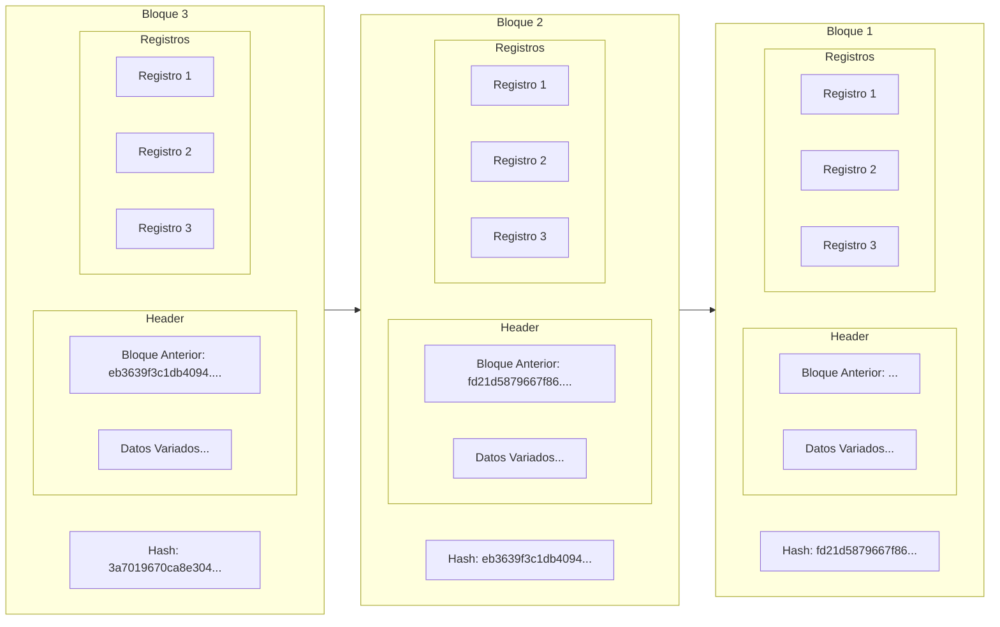
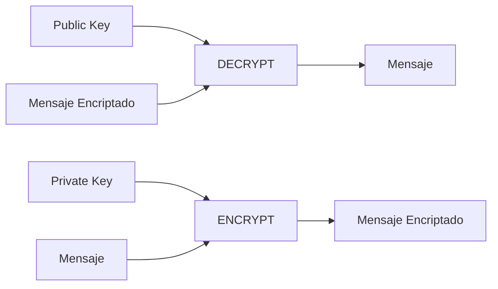

# TP TadCoin

Blockchain es una base de datos pública, segura, descentralizada e inalterable.
Cada nodo en la red posee una copia de esta y una vez hecho un cambio, es computacionalmente inviable modificarla.

Cuando un usuario desea guardar un registro en la blockchain, este se coloca dentro de un bloque que puede guardar muchos registros. Cada cierto tiempo, se genera un nuevo bloque que guarda un **hash criptográfico** del bloque anterior y los nuevos registros que se generen.
El resultado es una cadena de bloques que al estar vinculados por un **hash criptográfico**, resulta computacionalmente inviable modificar bloques anteriores.

#### ¿Hash Criptográfico?
Una función de hash es una función no inversible que toma cualquier dato y lo convierte en una cadena de largo fijo.
Es imposible saber exactamente qué dato original generó el hash ya que es una relación muchos a uno
(muchos datos pueden tener el mismo hash).

Una función de hash criptográfica es un caso especial de función de hash, la cual apunta a dar garantías sobre la 
seguridad de los datos. Una función de hash criptográfica produce un hash tan "aleatorio" que resulta inviable encontrar
dos datos que generen el mismo hash. También resulta inviable encontrar patrones sobre los datos de entrada que generen 
patrones sobre el hash de salida. El algoritmo de hash criptográfico más conocido es el **SHA-256**.

Volviendo a la blockchain, si se cambia algún dato de un bloque anterior, su hash cambiará **completamente**, de modo
que el bloque siguiente ya no apuntará a él. Si se quiere modificar un bloque anterior, se deberán modificar también
todos los bloques siguientes, creándose una blockchain totalmente nueva.

#### Mecanismo de Consenso

Habiendo tantas posibilidades de bifurcar la blockchain ¿cómo se decide cuál es la correcta?
Esto se hace a través de **Mecanismos de Consenso**.

Un mecanismo de consenso es un algoritmo que permite a los nodos de la red llegar a un acuerdo sobre el estado de la
blockchain al mismo tiempo que previene ataques maliciosos. Existen varios mecanismos de consenso, incluyendo: **Proof of Work**, **Proof of Stake**, **Proof of Authority**, entre otros.

### Criptomoneda
Una criptomoneda es un medio digital de intercambio basado en técnicas de criptografía. La mayoría de las criptomonedas
actuales se implementan sobre una blockchain, en donde los registros son transacciones de la moneda.

Cada transacción está **firmada digitalmente** por el dueño de la moneda, lo que garantiza que solo él puede gastarla.

#### Firma digital

El concepto de firmas digitales es sencillo: Existe un algoritmo matemático (por ejemplo **RSA**) que genera dos claves, de tipo string, que están vinculadas
matemáticamente. A una de ellas se la llama **clave privada** (SK) y a la otra **clave pública** (PK). La clave privada sólo la conoce el dueño 
y a la clave pública la conocemos todos.

También disponemos de una función, que toma un dato y una de las claves y genera un mensaje encriptado. Luego, con la otra clave, podemos desencriptar el mensaje.
Lo que una clave encripta, la otra desencripta.

Esto permite firmar cosas de forma digital: agarro el dato que quiero firmar, lo encripto con mi clave privada y lo publico.
Luego, como todos saben mi clave pública, pueden usarla para desencriptar el mensaje, verificando que fui yo quien firmó porque
se supone que sólo yo conozco la clave privada.

#### Proof of Work

El desafío de las criptomonedas es llegar a un consenso de cual es el estado de la blockchain. Es decir, dadas distintas versiones de la
blockchain ¿cual elijo?

Nosotros usaremos el mecanismo de **Proof of Work**. Siempre se elige la blockchain más larga, es decir, la que tenga más bloques.
Pero esto no es suficiente, ya que cualquiera puede agregar bloques. Si hacemos que sea difícil agregar bloques, entonces
los nodos empezarán a competir a ver quién es el primero en conseguir agregar uno.

Esta es la escencia del **Proof of Work**: los nodos compiten para ver quién es el primero en resolver un problema computacionalmente
exigente el cual les permite agregar un bloque. A cambio, reciben una recompensa.

##### ¿Cual es el problema a resolver concretamente?
El hash de un bloque debe comenzar con N ceros.  Cada bloque además de todos sus datos, contiene un numerito llamado *nounce*, el cual
es alterado intencionalmente para cambiar el hash del bloque. El objetivo es encontrar un *nounce* tal que el hash del bloque comience
con N ceros. Este proceso es conocido como **minería**.

El N es conocido como la dificultad del bloque. Si hacemos N variable, podemos controlar la dificultad de la minería:
a mayor N, más difícil es encontrar el *nounce* correcto. Entonces podemos reformular con cual blockchain nos quedamos:
No necesariamente la de mayor longitud, sino la de mayor dificultad (suma de las dificultades de sus bloques).

De esta manera, elegimos la blockchain que **demuestre que se requirió más trabajo para crearla**.

#### Bloque génesis
El bloque génesis es el que inicia la blockchain. No tiene un bloque anterior y por lo tanto no tiene un hash anterior.
Es el único bloque que no necesita cumplir con la dificultad de **Proof of Work**. En este bloque suele emitirse la criptomoneda
inicial, es decir, se crea la moneda de la nada.

## TadCoin

TadCoin es una criptomoneda basada en blockchain que implementa el mecanismo de **Proof of Work**.
1 TadCoin = 100.000.000 Tadoshis

Cada bloque contiene:
- Un hash del bloque anterior o ninguno si este es el bloque génesis.
- Una dificultad.
- Una fecha y hora de creación.
- Un *nounce*
- Un conjunto de transacciones.
- La recompensa de minería

El hash de cada bloque se calcula sólo en función de los datos del bloque y el *nounce*.

La dificultad de un bloque es un número entero que indica cuántos ceros al principio debe tener el hash del bloque para ser válido.

Cada transacción contiene:
- Un emisor
- Un receptor
- La cantidad entera de Tadoshis a transferir
- La comisión de la transacción en Tadoshis, que puede ser 0

Cada recompensa de minería contiene:
- La clave pública del minero
- La cantidad de Tadoshis recompensa por haber minado
- La suma de las comisiones de las transacciones del bloque minado

La transacción debe estar firmada digitalmente por el emisor.

### Condiciones de validez

La blockchain es válida si y sólo si:
- La dificultad es mayor a 0
- Tiene al menos un bloque
- Tiene un único bloque génesis
- Tiene un único bloque que no es anterior de nadie: el último
- No hay dos bloques que tengan el mismo bloque anterior
- Cada bloque es válido

Un bloque es válido si y sólo si:
- Es un bloque génesis válido o existe el bloque anterior en la blockchain
- Su fecha y hora es mayor estricto que el bloque anterior
- Su hash cumple con la dificultad
- Tiene al menos una transacción
- Tiene como máximo 2500 transacciones
- Todas sus transacciones son válidas
- Tiene una recompensa de minería válida

Un bloque génesis el válido si y sólo si:
- No tiene bloque anterior
- Contiene una única transacción que es la que emite los primeros Tadoshis
- Tiene una recompensa de minería válida

Por decisión del Dios Tadoshi, la recompensa de minería del bloque genésis NO PUEDE GASTARSE.
La del resto de los bloques, sí.

Una transacción es válida si y sólo si:
- Esta firmada digitalmente por el emisor
- La cantidad de Tadoshis es mayor estricto que 0
- La comisión es mayor o igual a 0
- El emisor tiene la cantidad de Tadoshis a transferir

Una recompensa de minería es válida si y sólo si:
- La cantidad de Tadoshis recompensa es mayor estricto que 0
- La cantidad de Tadoshis por comisión es efectivamente igual a la suma de las comisiones de las transacciones del bloque

Los emisores y receptores son claves públicas.

Antes de colocarse en la blockchain, el nuevo bloque se encuentra **sin confirmar**. Todas las nuevas transacciones son
agregadas a ese bloque y aun no se ha minado. Cuando el bloque es minado, se confirma y se agrega a la blockchain, siempre y cuando deje a
la blockchain en un estado válido.

La dificultad es variable y se calcula cada 15 bloques minados. Si la blockchain se mina más rápido de lo esperado, la
dificultad aumenta. Si se mina más lento, la dificultad disminuye. La dificultad se calcula como 150 veces la dificultad anterior 
dividido el período en minutos.

El período es el tiempo que transcurrió desde la última vez que se cambió la dificultad.

El balance de una clave pública se calcula como la suma de los Tadoshis que recibió menos la suma de los Tadoshis que envió.

#### Requerimientos
Se pide:
1. Poder crear la blockchain con el bloque génesis e ir agregando bloques con nuevas transacciones.
2. En el caso de realizar una operación que deje a la blockchain en un estado inválido, se debe registrar
qué operación fue, el motivo y qué bloque la causó.
3. Poder minar un bloque, es decir, encontrar el *nounce* correcto para que el hash del bloque cumpla con la dificultad.
4. Poder consultar el balance de una clave pública.
5. Dado un conjunto de blockchains distintas, determinar cual es la que más trabajo demuestra haber requerido.
6. Dado un conjunto de bloques sin confirmar ordenados por fecha, determinar un único bloque sin confirmar resultado de fusionarlos que:
    - Junta las transacciones del primero hasta que alguna sea inválida, luego agrega todas las del segundo, y así sucesivamente.
    - Permite saber de cada bloque, cual fue primera transacción que se detectó inválida y el motivo.
    - Puede no ser una fusión válida y en este caso no se pueden fusionar.

### Más que transacciones

Si bien, nuestra blockchain sólamente contiene transacciones, bien podríamos guardar cualquier cosa adentro de los bloques.
Esto permite extender los usos y las funcionalidades de la blockchain para ofrecer soluciones descentralizadas a otros
problemas.

Es por eso que surgen nuevos registros que se pueden guardar dentro de los bloques:
- **Token**: Un token es un nombre genérico para una criptomoneda. Podríamos no sólamente tener TadCoin, sino
otras criptomonedas dentro de nuestra blockchain. Cuando se crea un token, se emite una cantidad fija de ellos y se asigna a
su creador.
- **NFT**: Un NFT (Non Fungible Token) es un caso particular de token: es único. Por ejemplo, un NFT podría ser un ticket,
una obra de arte, una canción, un derecho de propiedad, etc. Se puede pensar como una moneda cuya cantidad emitida es 1.
- **Smart Contract**: Es un programa en la blockchain. Tiene asignada una clave pública y se ejecuta cuando lo llaman.

Los tokens creados contienen:
- Nombre único
- Clave pública del creador
- Cantidad de tokens emitidos (mayor a cero)
- La comisión cobrada por la emisión (mayor o igual a cero)

Los NFT creados contienen:
- Nombre único
- Clave pública del creador
- La comisión cobrada por la emisión (mayor o igual a cero)

Los Smart Contracts son más complejos y requieren una mayor explicación
#### Smart Contracts

Un contrato inteligente es un programa que se ejecuta en la blockchain. Cada vez que se llama a un contrato con ciertos
parámetros se ejecuta una funcionalidad que puede modificar el estado del contrato y de la blockchain.

La creación de un contrato inteligente siempre contiene:
- Clave pública del creador
- Clave pública asignada al contrato
- La comisión cobrada por la creación (mayor o igual a cero)
- Interfaz

La interfaz de los contratos inteligentes es el conjunto de operaciones que entiende.
Un operación sobre un Smart contract consiste de una instrucción y una cantidad N de parámetros, cada uno con su tipo.

Todas las operaciones sobre un contrato inteligente pueden fallar, ya sea porque está mal programado, porque se llama
a una instruccion que no existe, porque los parámetros no son los correctos o porque no se cumple alguna condición.

Todas las operaciones exitosas sobre los contratos inteligentes  devuelven una lista de registros de bloque,
que pueden ser de todo tipo, incluidos otros contratos.
Cada vez que se llama a un contrato inteligente, se cobra una comisión por el costo de ejecutarlo, la cual
cobran los mineros.

Algunos contratos inteligentes que necesitamos implementar son:
- **Swap Pool**: Permite a los usuarios cambiar un token por otro a cambio de una comision,
mientras que otros usuarios que depositaron el par de tokens pueden cobrar la comisión. Los tokens las comisiones de cada 
uno (fija o porcentual) y la tasa de cambio se determinan al momento de crear el contrato. Las operaciones que ofrece son:
    - **DEPOSITAR**: Un usuario lo llama para depositar un par de tokens en el contrato. Este obviamente debe tenerlos
  en su poder para hacerlo
    - **RETIRAR**: Un usuario lo llama para retirar la cantidad de tokens que depositó más las comisiones que ganó para
  cada token.
    - **SWAP**: Permite a un usuario cambiar un token por otro. La comisión se cobra en el token que se recibe.
- **Prestamo**: Permite a los usuarios pedir prestado un token a cambio de un interés anual, ofreciendo otro token como
colateral.
- **Subasta**: Permite a los usuarios subastar un NFT. Los usuarios pueden ofertar por el NFT y el dueño puede aceptar. 
Se le quitan los fondos al ganador y se le devuelven al resto.
